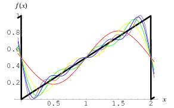
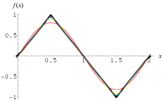

# Cynth

## Co je Cynth?

Cynth je programovatelný syntezátor zvuku, který pracuje s low-level zvukovými API [[1](#note-1-1)] a umožnujě práci v různých prostředích: Cynth je možné využít jako statickou i dynamickou knihovnu pro C++ [[2](#note-1-2)], nebo jako Python modul [[3](#note-1-3)], který zpřístupňuje většinu funkcionality z C++ knihovny.

---

`1:` Momentálně podporuje pouze WASAPI pro Windows.

`2:` V podobě `DLL` knihovny pro Windows.

`3:` V podobě `PYD` modulu pro Windows.

---

## Co je syntéza zvuku?

Zvuk se dá popsat mnoha způsoby. Jedním z nich je hudební teorie. Různé kultury mají různou hudební teorii, ale většinou jde o podobný princip. Vyskytují se koncepty jako výška tónu, barva tónu, rytmus apod. Hudební teorie se většinou zabývá technikami, jak tyto koncepty skládat dohromady a tím tvořit něco, co lidskému uchu zní příjemně. Nezabývá se však původem těchto konceptů. Rozlišuje barvu zvuku např. klavíru a kytary, rozlišuje různé výšky tónů a popisuje je notami, pak jim přiřazuje i rytmus podle toho, jak dlouho znějí. Neodpovídá ale na otázky jako "Co je tón?", "Jak se liší kytara od klavíru?".

Toto však popisuje fyzika. Popisuje zvuk jako vlnu, která má tři základní parametry: frekvenci, amplitudu a vlnovou funkci. Frekvence, neboli počet opakování jedné periody za časový úsek, ovlivňuje výšku tónu. Amplituda, neboli rozkmit vlny, ovlivňuje hlasitost tónu. Vlnovou funkcí je myšlen tvar jedné periody. Tento tvar ovlivňuje barvu zvuku. Lidské ucho vnímá zvuk jako složené sinusoidy, tedy libovolnou zvukovou vlnu si rozloží na jednotlivé sinusoidy o různých amplitudách a frekvencích a právě toto složení různých vln je vnímáno jako barva zvuku. K tomu může posloužit matematický koncept - Fourierova řada, která umožňuje libovolnou funkci zapsat jakou součet sinusoid. Tento koncept využívá aditivní syntéza, která docílí určité barvy zvuku právě skládáním sinusoid. Tímto se však Cynth přímo nezabývá. Namísto skládání sinusoid se využívají již složené typické funkce jako sawtooth vlna, tvarem připomínající zuby pily. Na následujícím obrázku je zobrazena jedna perioda sawtooth vlny (černě) a složené sinusoidy z Fourierovy řady, které vnímá lidské ucho:

Další typické vlny jsou square a triangle:

Tyto typické vlny se často využívají při běžné syntéze zvuku, proto jsou v Cynthu předem dané. Není ale problém si nadefinovat vlastní vlnovou funkci pro dosažení specifického výsledku.

Každá vlna (kromě právě čisté sinusoidy) je tedy uchem vnímána jako složení více sinusoid. Tyto sinusoidy mají různé frekvence a amplitudy. Lidské ucho je schopno vnímat více složených vln, třeba z různých nástrojů, a rozložit si je na zvláštní vlny a tak rozpoznat tyto nástroje od sebe i přes to, že hrají zároveň. V případě rozkládání zmíněných vln (sawtooth apod.) je však jedna z těchto sinusoid dominantní natolik (svojí amplitudou), že ji lidské ucho vnímá jako ten základní tón a ty ostatní pouze jako tzv. alikvótní tóny, které tento základní tón pouze doprovázejí a ovlivňují jeho barvu, spíše než že by zněly jako zvláštní zvuky.

Závěrem je, že i když si člověk třeba zazpívá notu C, tak nezní pouze tato nota, ale i mnohé další z tzv. vyšších harmonických tónů. Dokonce lze znění těchto alikvótních tónů ovládat tak, že jsou opravdu slyšet jako zvláštní tóny. Toho využívá například hrdelní zpěv, kdy zpěvák zvívá zdánlivě několika hlasy zároveň. Hlavně nás ale zajímá to, že každý hudební nástroj vydává zvuk lehce jiným způsobem - používá struny, membrány, nebo jiné prostředky a tyto např. struny mohou být upevněné jiným způsobem a rozkmitány jiným způsobem. To vše ovlivňuje, jaké vzniknou alikvótní tóny a tedy jakou barvu bude tento nástroj mít.

To však není vše, co ovlivní zvuk tónu. Například klavír využívá jako svojí tzv. rezonanční skříň (prostor, ve kterém vniká, rezonuje a tak se i zesiluje zvuk) poměrně velký prostor, zatímco, kytara má rezonanční skříň mnohem menší a obě jsou značně různých tvarů. Toto hlavně omezuje některé frekvence vznikající ať už jako základní, nebo alikvótní tóny.

## Syntéza zvuku: Analogový přístup

V přírodě může být zdrojem zvuku struna, membrána, hlasivky apod. - cokoliv, co rozechvěje vzduch, tzv. oscilátor. První techniky syntézy zvuku (analogické) využívaly elektronických oscilátorů, tedy nekmitá vzduch, ale jde o nějakou vlnu v napětí/proudu elektřiny. Tato vlna pak ovládá fyzické kmitání reproduktoru, který slouží jako fyzická kmitající blána, která je právě zdrojem reálného zvuku.

### Tone generator

Říkejme zdrojovému oscilároru tone generator. Na cestě od tone generatoru k reproduktou se vlna modifikuje různými dalšími elektronickými přístroji. Například tzv. lfo, envelope, filter, compressor apod.

### LFO

LFO je zkratkou pro low frequency oscillator, tedy jde opět o obyčejný oscilátor, akorát osciluje na nižších frekveních. Tone generator osciluje na frekvencích cca 20Hz-20kHz, tedy frekvencích, které lidské ucho vnímá jako tón. LFO osciluje na mnohem nižších frekvencích (řádově max. desítky Hz) a jeho účelem je ovládat jiné přístroje. Může například ovládat amplitudu tone generatoru a tak vytvořit to, čemu hudební teorie říká vibrato.

### Envelope

Vrátím se k pohledu na hudební nástroje. Když zazní tón na klavíru, začne znít ihned hlasitě (s vysokou amplitudou) a postupně se stiší (amplituda se sníží), zatímco třeba na houslích je možné průběh amplitudy ovládat smyčcem. Envelope dělá právě toto. Podobně jako LFO, ovládá envelope např. amplitudu tone generátoru nějakou funkcí, která začíná v okamžiku, kdy tone generator dostane signál, že má začít "hrát", tedy například kdy se stiskne tlačítko připojeného elektronického nástroje. Po puštení tlačítka se dostává funkce do poslední fáze. Průběh této funkce se standardně popisuje čtyřmi parametry:

* `attack`: Čas, za který amplituda stoupne z nuly na maximum od okamžiku stisku tlačítka.
* `decay`: Čas, za který amplituda potom klesne na amplitudu udanou jako `sustain`.
* `sustain`: Amplituda na kterou se klesne po oběhnutí `decay` času.
* `release`: Čas, za který amplituda klesne na nulu od okamžiku puštění tlačítka.

### Ostatní

Filter řeší omezení určitých frekvencí, jak jsem popisoval na příkladu rezonanční skříně. Zjednodušeně řečeno funguje opravdu jako síto - určité frekvence nepropouští. Jak ale konktrétně ovlivňuje vlnovou funkci v konkrétním okamžiku je ale složitější popsat, jde o poměrně komplikovaný matematický koncept.

Compressor nějakým způsobem omezuje amplitudu signálu. Většinou si rozdělí amplitudy nějakou mezí a tlumí třeba ty, co tuto mez přesahují, nebo naopak.

## Syntéza zvuku: Digitální přístup

Analogový syntezátor pracuju se spojitým signálem. Jakýkoliv pokus o převedení konceptu syntezátoru do digitálního prostředí samozřejmě musí řešit převedení tohoto spojitého signálu na digitální, tedy diskrétní signál.

Čas se rozdělí na diskrétní úseky, kterým odpovídá tzv. sample - jednotka digitálního signálu obsahující informaci o amplitudě v podobě diskrétní hodnoty. Toto rozdělení času udává veličina `sample rate`, která odpovídá počtu samplů za sekundu. Přesnost amplitudy udává veličina `bit depth`, která odpovídá počtů bitů na sample.

Standardní hodnoty `bit depth` jsou: zastaralých 8 bitů, běžných 16 bitů pro CD kvalitu, 24 bitů pro WAV kvalitu a často i 32 bitů pro přímou práci se zvukem, či pro nějaké nestandardní formáty. Většinou se amplituda reprezentuje jako signed integer v rozmezí od minimální po maximální hodnotu vyjádřitelnou s dostupným počtem bitů. V některých případech jde o unsigned integer a někdy (hlavně při přímé práci se zvukem) dokonce i IEEE 32 bitový floating point (v ojedinělých případech i 64 bitový).

Ovladač zvukové karty přijímá proud těchto samplů v určitém formátu, co podporuje a v kterém momentálně operuje. Je jen na operačním systému (případně na programátorovi, pokud pracuje s ovladači přímo [[1](#note-2-1)]), aby převedl formát aktuálně přehrávaného zvuku na formát ovladačů. Tento proud dat se přenáší v podobě bufferu: Přehrávající program se domluví s ovladačem na tom, kde v paměti od něj očekává kus samplů, kolik jich očekává a kdy bude připraven další buffer na další samply.

Ovladač pak řeší převedení získaného digitálního signálu na analogový a jím rozkmitá reproduktor. Samozřejmě zobrazení `analog -> digital` není bijekce a tedy jeho inverzní zobrazení můžeme pouze odhadnout. Z tohoto odhadu plyne zkreslení zvuku, ale tímto se Cynth samozřejmě nezabývá, jde o práci ovladače.

Při digitální syntéze se stále využívají všechna zmíněná analogová zařízení, akorát v podobě nějaké digitální abstrakce.

---

`1:` Momentálně pracuje Cynth s WASAPI pouze v shared mode, což znamená, že předává data nikoliv ovladači přímo, ale sound enginu (v jeho formátu), který signál ze Cynthu mixuje spolu s ostatními systémovými zvuky před předáním ovladačům. Toto umožňuje využívání Cynthu nepřetržitě s ostatními programy a navíc to řeší převod formátu, avšak na druhou stranu to omezuje minimum latence (opoždění signálu) podle nastavení sound enginu.

---